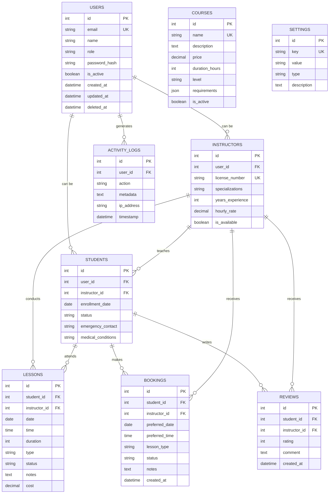

# 🔧 Technical Documentation - DriveSchool Pro v3.0

## Architecture Overview

DriveSchool Pro v3.0 is built using a modern full-stack architecture with Next.js 15, React 19, and MySQL 8.0.

### System Architecture

```
┌─────────────────┐    ┌─────────────────┐    ┌─────────────────┐
│   Frontend      │    │   Backend       │    │   Database      │
│                 │    │                 │    │                 │
│ React 19        │◄──►│ Next.js API     │◄──►│ MySQL 8.0      │
│ Tailwind CSS    │    │ Drizzle ORM     │    │ Connection Pool │
│ Radix UI        │    │ JWT Auth        │    │ Transactions    │
│ PWA Service     │    │ Middleware      │    │ Foreign Keys    │
└─────────────────┘    └─────────────────┘    └─────────────────┘
```

## 🗄️ Database Design

### Entity Relationship Diagram



### Database Schema Details

#### Users Table
Primary table for all user authentication and basic information.

```sql
CREATE TABLE users (
  id INT PRIMARY KEY AUTO_INCREMENT,
  email VARCHAR(255) UNIQUE NOT NULL,
  name VARCHAR(255),
  role ENUM('admin', 'instructor', 'student') DEFAULT 'student',
  password_hash VARCHAR(255) NOT NULL,
  phone VARCHAR(20),
  avatar TEXT,
  is_active BOOLEAN DEFAULT true,
  created_at TIMESTAMP DEFAULT CURRENT_TIMESTAMP,
  updated_at TIMESTAMP DEFAULT CURRENT_TIMESTAMP ON UPDATE CURRENT_TIMESTAMP,
  deleted_at TIMESTAMP NULL
);
```

#### Relationships & Constraints
- Foreign key constraints ensure data integrity
- Soft deletes using `deleted_at` timestamps
- Unique constraints on business-critical fields
- Indexes on frequently queried columns

## 🔐 Authentication System

### JWT Token Structure

```typescript
interface SessionData {
  user: {
    id: number;
    role: string;
    email: string;
  };
  expires: string;
}
```

### Role-Based Access Control

```typescript
// Role hierarchy (higher number = more permissions)
const roleHierarchy = {
  admin: 3,
  instructor: 2, 
  student: 1
};

// Permission matrix
const rolePermissions = {
  admin: [
    'manage_users', 'manage_instructors', 'manage_students',
    'manage_courses', 'manage_settings', 'view_analytics'
  ],
  instructor: [
    'view_assigned_students', 'manage_own_lessons',
    'manage_own_bookings', 'view_own_schedule'
  ],
  student: [
    'view_own_profile', 'book_lessons',
    'view_own_lessons', 'submit_reviews'
  ]
};
```

### Authentication Flow

```
1. User submits credentials
2. Server validates against database
3. JWT token generated with user data
4. Token stored in secure HTTP-only cookie
5. Middleware validates token on protected routes
6. Role-based access enforced per endpoint
```

## 🛠️ API Design

### RESTful API Structure

```
/api/
├── auth/
│   ├── signin          # POST - User login
│   ├── signup          # POST - User registration
│   └── signout         # POST - User logout
├── admin/
│   ├── stats           # GET - System statistics
│   ├── users/          # GET, POST - User management
│   └── users/[id]      # GET, PUT, DELETE - User CRUD
├── instructor/
│   ├── students        # GET - Assigned students
│   ├── lessons         # GET - Instructor lessons
│   └── bookings/       # GET - Booking requests
└── public/
    ├── courses         # GET - Available courses
    └── instructors     # GET - Available instructors
```

### API Response Format

```typescript
// Success Response
interface ApiResponse<T> {
  success: true;
  data: T;
  message?: string;
}

// Error Response  
interface ApiError {
  success: false;
  error: string;
  code?: string;
  details?: any;
}
```

### Middleware Chain

```typescript
// Request processing pipeline
Request → Authentication → Authorization → Rate Limiting → Handler → Response
```

## 🎨 Frontend Architecture

### Component Structure

```
components/
├── ui/                 # Base UI components (Radix UI)
├── admin/             # Admin-specific components
├── instructor/        # Instructor-specific components
├── student/           # Student-specific components
├── driving-school/    # Public components
└── layout/            # Layout components
```

### State Management Strategy

1. **Server State**: React Server Components + SWR for client hydration
2. **Client State**: React useState for component-level state
3. **Form State**: React Hook Form with validation
4. **Authentication State**: JWT token validation per request

### Styling Architecture

```
styles/
├── globals.css        # Global styles and Tailwind imports
├── components.css     # Component-specific styles
└── variables.css      # CSS custom properties
```

## 🔄 Data Flow

### Server-Side Rendering Flow

```
1. User requests page
2. Next.js calls page component
3. Authentication check (getUser)
4. Database queries (if authenticated)
5. Server renders with data
6. HTML sent to client
7. Client hydrates with React
```

### Client-Side Navigation

```
1. User clicks navigation
2. Next.js router handles routing
3. Layout component checks authentication
4. Role-based component rendering
5. API calls for additional data
6. Optimistic UI updates
```

## 📊 Performance Optimizations

### Database Optimizations

```sql
-- Indexes for frequently queried columns
CREATE INDEX idx_users_email ON users(email);
CREATE INDEX idx_lessons_date ON lessons(date);
CREATE INDEX idx_bookings_status ON bookings(status);
CREATE INDEX idx_students_instructor ON students(instructor_id);

-- Connection pooling configuration
MYSQL_CONNECTION_LIMIT=10
MYSQL_IDLE_TIMEOUT=60000
MYSQL_ACQUIRE_TIMEOUT=60000
```

### Frontend Optimizations

1. **Code Splitting**: Automatic with Next.js App Router
2. **Image Optimization**: Next.js Image component
3. **Bundle Analysis**: webpack-bundle-analyzer
4. **Caching Strategy**: Static generation + ISR

### Caching Strategy

```typescript
// API Route caching
export const revalidate = 3600; // 1 hour

// Database query caching
const getCachedUsers = cache(async () => {
  return db.select().from(users);
});
```

## 🔒 Security Implementation

### Input Validation

```typescript
// Zod schemas for validation
const userSchema = z.object({
  email: z.string().email(),
  password: z.string().min(8),
  name: z.string().min(1).max(100)
});
```

### SQL Injection Prevention

```typescript
// Drizzle ORM with prepared statements
const user = await db
  .select()
  .from(users)
  .where(eq(users.email, email)); // Automatically parameterized
```

### XSS Protection

- React's built-in XSS protection
- Content Security Policy headers
- Input sanitization on server side

### CSRF Protection

- Next.js built-in CSRF protection
- SameSite cookie attributes
- HTTP-only cookies for tokens

## 🚀 Deployment Architecture

### Production Environment

```
Load Balancer (Nginx)
├── Next.js App (Node.js)
├── MySQL Database
├── Redis Cache (optional)
└── File Storage (AWS S3/Local)
```

### Environment Configuration

```bash
# Production optimizations
NODE_ENV=production
MYSQL_CONNECTION_LIMIT=20
NEXTAUTH_URL=https://your-domain.com
```

## 📱 PWA Implementation

### Service Worker Strategy

```javascript
// sw.js - Cache-first strategy
self.addEventListener('fetch', event => {
  if (event.request.destination === 'document') {
    event.respondWith(
      caches.match(event.request)
        .then(response => response || fetch(event.request))
    );
  }
});
```

### Offline Capabilities

1. **Static Assets**: Cached via service worker
2. **API Responses**: Background sync for critical operations
3. **Form Submissions**: Queue for offline submission

## 🧪 Testing Strategy

### Testing Pyramid

```
                    E2E Tests (Cypress)
               ↗                      ↖
        Integration Tests (API)    Component Tests (Jest)
     ↗                                                ↖
Unit Tests (Functions)                        Unit Tests (Utils)
```

### Test Configuration

```typescript
// jest.config.js
module.exports = {
  testEnvironment: 'jsdom',
  setupFilesAfterEnv: ['<rootDir>/jest.setup.js'],
  moduleNameMapping: {
    '^@/(.*)$': '<rootDir>/$1'
  }
};
```

## 🔍 Monitoring & Logging

### Error Tracking

```typescript
// Error boundary for React components
class ErrorBoundary extends Component {
  static getDerivedStateFromError(error: Error) {
    return { hasError: true };
  }
  
  componentDidCatch(error: Error, errorInfo: ErrorInfo) {
    console.error('App Error:', error, errorInfo);
  }
}
```

### Performance Monitoring

```typescript
// Core Web Vitals tracking
import { getCLS, getFID, getFCP, getLCP, getTTFB } from 'web-vitals';

getCLS(console.log);
getFID(console.log);
getFCP(console.log);
getLCP(console.log);
getTTFB(console.log);
```

## 🔧 Development Tools

### Database Tools

```bash
# Drizzle Studio - Visual database browser
npm run db:studio

# Migration management
npm run db:generate  # Create migrations
npm run db:migrate   # Apply migrations
npm run db:drop      # Drop database
```

### Development Debugging

```typescript
// Debug mode configuration
if (process.env.NODE_ENV === 'development') {
  console.log('Debug info:', { user, query, result });
}
```

## 📈 Scalability Considerations

### Horizontal Scaling

1. **Database**: Read replicas for query scaling
2. **Application**: Multiple Next.js instances behind load balancer
3. **Assets**: CDN for static file delivery
4. **Cache**: Redis for session and query caching

### Vertical Scaling

1. **Database**: Increase MySQL memory and CPU
2. **Application**: Increase Node.js memory limit
3. **Connection Pool**: Optimize pool size for workload

---

This technical documentation provides the foundation for understanding, maintaining, and extending DriveSchool Pro v3.0.